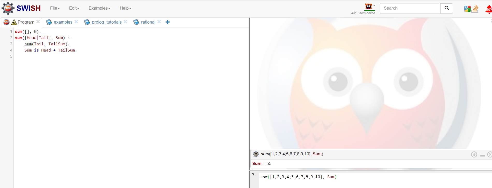

# Задача
Написать программу на языке Prolog для вычисления суммы 
элементов списка. 

На вход подаётся целочисленный массив. 
На выходе - сумма элементов массива.

* определяем предикат для вычисления суммы элементов списка
* определяем базовый случай, если список пустой
* рекурсивно определяем сумму оставшейся части списка
* сумма списка = сумме головы и оставшейся части списка